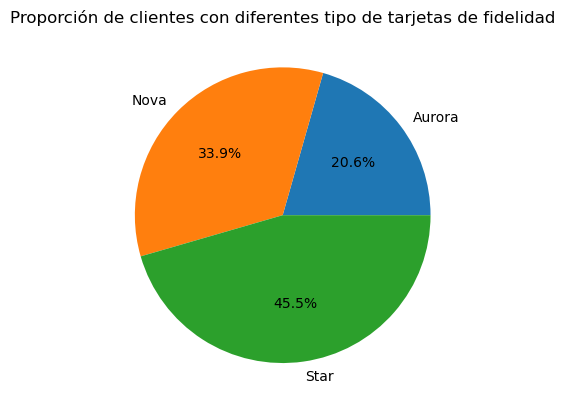
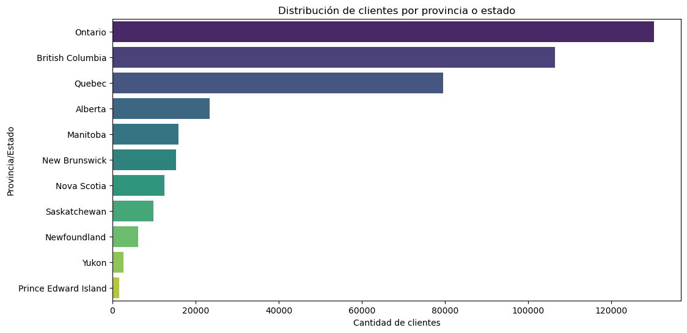
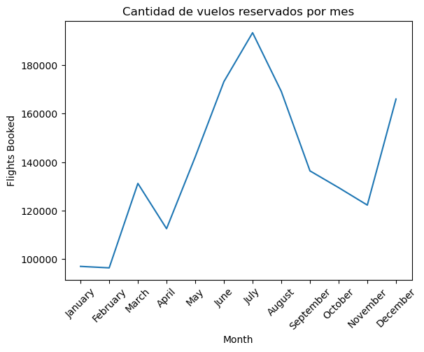

# ✈️ Despegando hacia el Análisis: Un Viaje por los Datos del Programa de Lealtad Aérea 

## Introducción: Abordando el Análisis de Datos 

En este proyecto, nos embarcaremos en un emocionante viaje a través de los datos del programa de lealtad de una aerolínea. Nuestro objetivo principal será desentrañar los secretos que se esconden en el comportamiento de los clientes, utilizando el poder del análisis de datos para obtener información valiosa que impulse estrategias y decisiones más inteligentes.

## Nuestra Misión: Revelando los Patrones de Vuelo ️

1.  **Exploración y Limpieza de Datos:**

    *   Como pilotos expertos, realizaremos una inspección exhaustiva de nuestros datos, identificando y corrigiendo cualquier irregularidad o valor atípico que pueda afectar nuestro análisis.
    *   Uniremos los dos conjuntos de datos, "Customer Flight Activity.csv" y "Customer Loyalty History.csv", como si estuviéramos combinando mapas de vuelo y perfiles de pasajeros para obtener una visión completa de cada cliente.

2.  **Visualización de Datos:**

    *   Utilizaremos nuestras habilidades de visualización para crear gráficos impactantes que revelen patrones y tendencias interesantes en los datos.
    *   Responderemos preguntas clave como:
        *   ¿Cuál es la proporción de clientes con diferentes tipos de tarjetas de fidelidad?
            
        *   ¿Cuál es la distribución de los clientes por provincia o estado?
            
        *   ¿Cómo se distribuye la cantidad de vuelos reservados por mes durante el año?
            
      

3.  **Análisis Estadístico (Bonus):**

    *   Nos sumergiremos en un análisis más profundo para evaluar si existen diferencias significativas en el número de vuelos reservados según el nivel educativo de los clientes.
    *   Utilizaremos pruebas de hipótesis estadísticas para determinar si estas diferencias son estadísticamente relevantes.

## Nuestros Instrumentos de Vuelo: Herramientas y Técnicas ️

*   **Python:** Nuestro lenguaje de programación de confianza para el análisis de datos.
*   **Pandas:** La librería que nos permitirá manipular y transformar los datos con facilidad.
*   **Matplotlib y Seaborn:** Nuestras herramientas de visualización para crear gráficos informativos y atractivos.
*   **Pruebas de Hipótesis:** Técnicas estadísticas para evaluar la significancia de nuestras observaciones.

## Entregables: El Reporte de Nuestro Viaje 

*   **Código de Python:** El registro detallado de nuestro análisis, desde la exploración inicial hasta las conclusiones finales.
*   **Readme:** Este documento que describe nuestro viaje, los objetivos, los datos utilizados y los hallazgos principales.
*   **Gráficos:** Las representaciones visuales de nuestros descubrimientos, listas para ser compartidas y comprendidas.

## El Despegue: ¡Comencemos la Aventura! 

Este proyecto es una oportunidad emocionante para demostrar nuestras habilidades como analistas de datos y descubrir información valiosa que puede ayudar a la aerolínea a fortalecer su programa de lealtad y mejorar la experiencia de sus clientes. ¡Abróchate los cinturones y prepárate para el despegue!

## Elena Alique, Febrero 2025